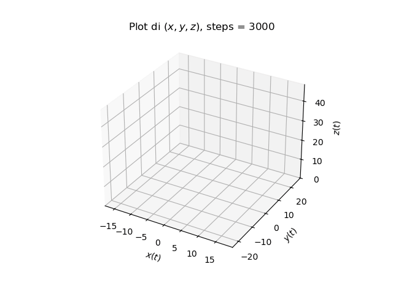
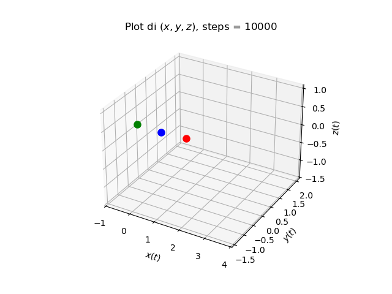

# Laboratorio di Fisica Computazionale, A.A. 2023-24

|  |  |
|---------------------------------------------|----------------------------------------|

## Introduzione
In questa repository si possono trovare gli esercizi per il corso di "Laboratorio di Fisica Computazionale", svoltosi nell'anno accademico 2023-24. Il linguaggio utilizzato per la risoluzione degli esercizi è C++, insieme a Python per disegnare i plot.

## Argomenti
- Rappresentazione di numeri sul calcolatore e approssimazioni (esercizi 1 e 2)
- Integrazione numerica con metodi deterministici (esercizi da 3 a 7)
- Metodi Monte Carlo (esercizi da 8 a 13)
- Equazioni differenziali ordinarie (esercizi da 14 a 18)
- Ricerca degli zeri di funzioni (esercizi 19 e 20)
